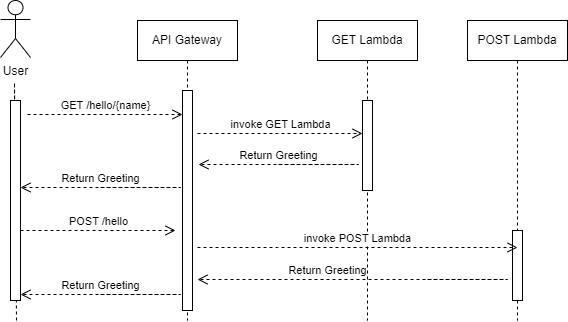

# Recruitment API
testing ssh
This project implements a simple Recruitment API using AWS CDK (Cloud Development Kit). The API provides two endpoints, one for handling `GET` requests and another for `POST` requests. Both endpoints are integrated with AWS Lambda functions written in TypeScript, with the infrastructure defined and deployed using AWS CDK.

## Table of Contents

- [Setup Instructions](#setup-instructions)
- [API Endpoints](#api-endpoints)
- [Testing](#testing)
- [Deployment](#deployment)
- [Useful Commands](#useful-commands)
- [Diagram](#sequence-diagram)
- [License](#license)


## Setup Instructions
Clone the repository and install dependencies.

Git clone [https://github.com/toseef-ahmd/recruitment-api.git](https://github.com/toseef-ahmd/recruitment-api.git)
 
 ``` cd recruitment-api ```

 ``` npm install ```


## Testing
Use ``` npm run test ``` to test the code. It will run both unit and integration tests.

## Deployment
Use ``` cdk deploy ``` to deploy the code.

## Useful Commands

Use ``` npm run build ``` to build the project.

Use ``` npm run lint ``` to check for any linting errors according to predefined rules and fix them. 

Use ``` npm run format ``` to run prettier to automatically enforce consistent style rules across the codebase.

Use ``` cdk destroy ``` to delete the stack and associated resources

Use ``` cdk synth ``` to synthesize the cloudFormation template

# Sequence Diagram


The diagram in XML format can be found [here](./sequence-diagram/sequence-diagram.drawio)


## Licence 
This project is licensed under the MIT License.
